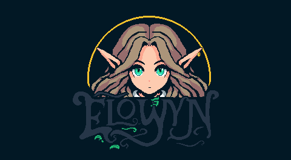

A passion project game that I am working on

I received inspiration for this project while playing *The Legend of Zelda: the Minish Cap* on a series of plane rides.

This game also has very light inspiration drawn from the following (in no particular order):
- George Orwell
- KDA
- My Chemical Romance
- Studio Ghibli
- A single screenshot from the 2022 TGA announcement trailer for *Remnant II*
- The complexity of FromSoftware lore and world building
- The many, many GameBoy Advance games I played as a kid, as it was the first console I ever owned
- James Brandon Greer and the beautiful pixel art he has shared over the years
